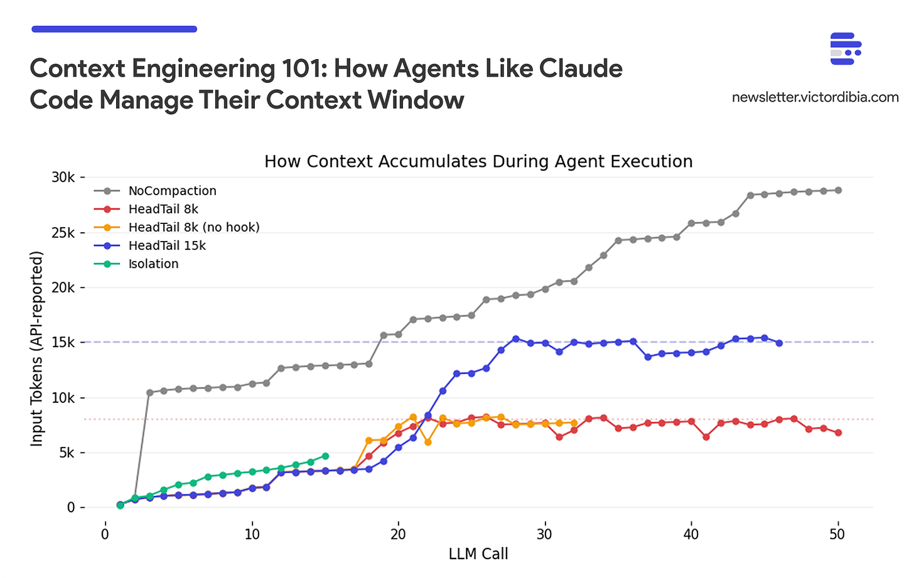
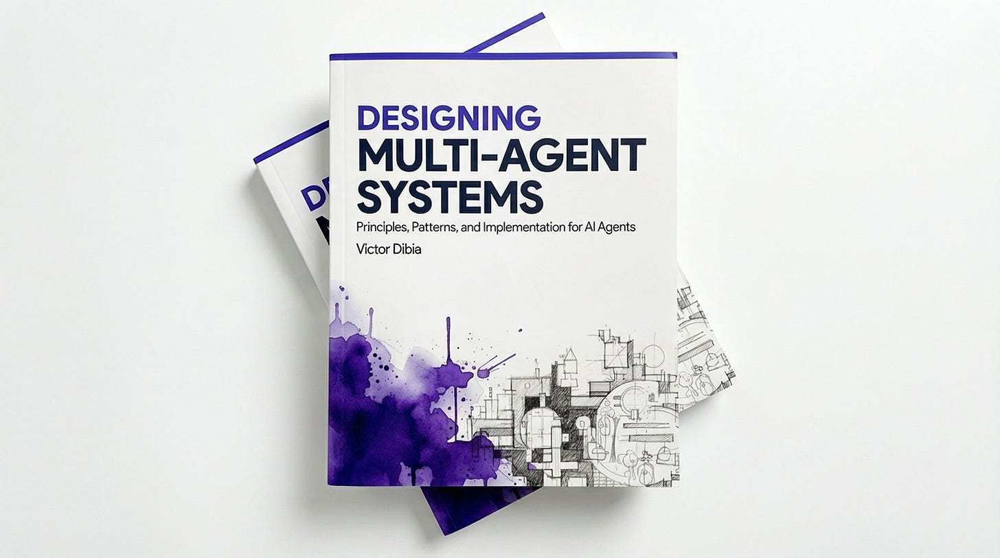
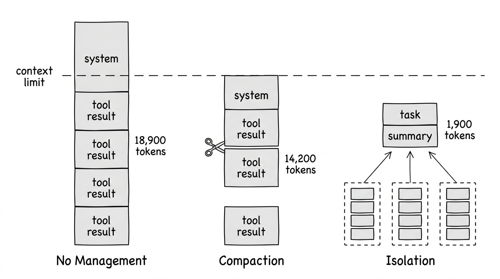
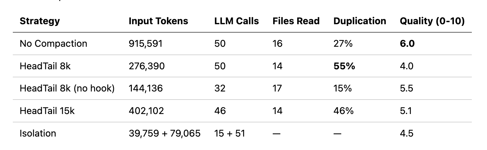

# 如何为你的 Agent 实现 Context Engineering 策略（Claude Code）



> **原文**：https://newsletter.victordibia.com/p/context-engineering-101-how-agents  
> **作者**：Victor Dibia, PhD  
> **翻译**：由 OpenClaw 翻译

**#59 | 管理 context 增长、防止提前停止、衡量什么有效**

---

上下文增长因所实现的 context engineering 策略而异，相同的代码审查任务（44 个文件仓库，gpt-4.1-mini）。无策略时 context 单调增长；HeadTail context compaction 策略在预算阈值处呈现锯齿状；Isolation 在每次 coordinator 调用时 token 有界限。

你的 agent 完成了任务。它读取了 12 个文件，追踪了 3 个调用栈，进行了 15 次 LLM 调用，最终找到了 bug。但它为此消耗了 120,000 个 token——在 frontier 模型上大约 $1.80。每天运行 50 次，一个团队每月就是 $2,700。

大多数通用 agent 基准测试（如 Claude Code 和 GitHub Copilot）关注任务完成度——它完成了吗？但实际上，**它是如何完成的**同样重要。读取了目录中每个文件而实际只需要三个文件的 agent。压缩了 context、丢失了关键信息、然后重新读取相同文件的 agent。携带 50,000 token 陈旧工具结果进入每次 LLM 调用、因为没有任何东西告诉它遗忘的 agent。这些 agent 可能会成功，但成功得很昂贵——对于关注 API 账单的个人开发者，或希望规模化运行 agent 的企业，context 管理可以显著降低 token 成本，尽管通常伴随着需要理解的质量权衡。

Agent 中的 context 是累积的——来自先前步骤的每条消息、工具结果和模型响应都会被携带到每次新的 LLM 调用中。随着底层模型改进，agent 可以处理更长时域的任务（METR 基准测试显示 frontier 模型以 80% 可靠性完成相当于约 70 小时人类工作量的任务，任务复杂度大约每 7 个月翻一番）。但更长的任务意味着更多累积的 context，这产生了三个问题：context 窗口填满导致请求被拒绝、token 成本随 context 规模增长、模型性能随 context 增长而下降（Liu et al., 2023）。

Context engineering 是在 agent 运行过程中管理进入 context 窗口内容的学科。虽然我们偶尔看到 "Claude is compacting" 的消息，或者关于 note taking 或 skills 如何帮助 context 的帖子，但关于如何实现这些策略及其对性能影响的确切细节往往模糊。在这篇文章中，我深入分析了 context engineering 的核心策略、如何实现它们，以及基于我在五种 agent 配置上运行的基准测试的权衡。

**TLDR；这篇文章涵盖：**

- 多步骤 agent 任务中的 context 爆炸问题
- Context engineering 的三个核心策略：compaction、isolation 和 agentic memory
- 在代码审查任务上比较这些策略的基准测试，显示 token 成本之间的权衡
- 关于何时及如何在 agent 中应用 context engineering 的关键要点

> **注**：对于低复杂度任务，context engineering 不那么关键。过早优化也可能损害性能。
>
> 本文改编自我的书《Designing Multi-Agent Systems》，在该书中我与 agent 架构、memory 系统和多 agent 协调一起涵盖了 context engineering 模式（第 4 章）。

---

## 更多 Context ≠ 更好的 Context

理解 context engineering 为何重要，关键第一步是建立正确的直觉，了解 context 在 agent 执行过程中如何增长。你可以通过 context 检查做到这一点。

重要的是，回顾 agentic 循环——agent 通过进行 LLM 调用、解释响应、调用工具、重复来完成任务。默认情况下，所有先前的消息和工具结果都会附加到每次新 LLM 调用的 context 窗口中。

例如，这里是天真 agent 运行多步骤研究任务时发生的情况。agent 将每条消息和工具结果附加到其 context：

```
Iteration 1:    888 tokens  (system + user message)
Iteration 2:  3,400 tokens  (+ list_directory result)
Iteration 3:  8,900 tokens  (+ read_file: context.py)
Iteration 4: 14,200 tokens  (+ read_file: compaction.py)
Iteration 5: 18,900 tokens  (+ grep + read_file: _agent.py)
```

来自 PicoAgents 基准测试运行的 token 增长（debug_investigation 任务，gpt 模型，无 compaction）。每次迭代将工具结果添加到消息历史中。

有趣的是，问题不仅仅是 context 窗口的硬限制（大多数 LLM 现在支持非常大的窗口）。相反，研究表明 LLM 即使在技术上能容纳的情况下也会在大 context 中挣扎：

**迷失在中间**：长 context 中间的信息比开头或结尾的信息受到的注意更少（Liu et al., 2023）

**性能下降**：准确性可能根据信息位置而非仅仅是是否容纳而显著下降

**工作记忆**：context 窗口充当 agent 的工作记忆。但与 RAM 不同，添加更多数据可能主动降级现有数据的检索。Context engineering 策划什么保留在那个窗口中

**更多 context 并不总是意味着更好的结果。**



---

## 什么是 Context Engineering？

Context engineering 是在 agent 运行过程中管理进入 context 窗口内容的一套技术。它回答四个关键问题：

- **包含什么** —— 选择相关信息
- **排除什么** —— 修剪噪音和冗余
- **如何表示** —— 高效压缩信息
- **放在哪里** —— 为模型注意力定位

Andrej Karpathy 将其描述为"在 context 窗口中填充恰好正确信息给下一步的微妙艺术和科学"。许多 agent 失败追溯到 context 问题；模型有正确的能力，但错误的信息在 context 窗口中（或缺失）。

---

## 三个核心策略

我们可以将 context engineering 技术分为三个核心策略：



---

### 策略 1：Compaction（响应式修剪）

Compaction 通过修剪、总结或选择性保留消息来减少 context。它发生在 agentic 循环中每次 LLM 调用之前，由条件触发。

从 agent 用户的角度来看，你在创建 agent 时配置 context 策略：

```javascript
// Agent with head+tail compaction - keeps task definition + recent work
const agent = new Agent({
  name: "investigator",
  instructions: "Investigate the codebase and find the bug.",
  modelClient: modelClient,
  tools: [readFile, listDirectory, grep],
  compaction: new HeadTailCompaction({
    tokenBudget: 100_000,  // 当 context 超过此时压缩
    headRatio: 0.2,        // 20% 用于 task context，80% 用于近期工作
  }),
  maxIterations: 20,
});

const response = await agent.run(
  "Find why the auth middleware fails on refresh tokens."
);
```

底层原理：

```javascript
while (!done) {
  // 在调用模型之前检查是否需要 compaction
  if (contextExceedsBudget(messages)) {  // 例如 > 80% 限制
    messages = compact(messages);
  }
  response = callLLM(messages);
  // ... 处理响应，执行工具，附加结果
}
```

如果你使用过编码 agent（Claude Code、GitHub Copilot CLI 等），你可能偶尔看到 agent 暂停，提到 "compacting"，总结先前步骤，然后继续。这就是 compaction 策略。Agent 达到了阈值（例如 context 窗口的 80%，或 100k token 的硬限制）并在下次 LLM 调用之前触发了 compaction。预算决定何时压缩；下面的方法决定如何压缩。

**Sliding Window**：保留系统消息 + 适合预算的最新消息。最简单的方法。

**Head+Tail**：将预算分配给 head（系统提示、初始任务）和 tail（近期工作）。丢弃中间消息。这保留了任务定义和近期进度。

**工具结果清除**：一旦工具在历史深处被调用，清除原始结果但保留消息结构。Anthropic 最近在 Claude Developer Platform 上推出了这个——这是最轻量级的 compaction 形式。

**总结**：使用快速模型将旧消息压缩成摘要。比丢弃保留更多信息，但代价是额外的 LLM 调用。它也可能缺乏分辨率——摘要可能遗漏稍后需要的信息。在下面描述的基准测试中，存在 "thrashing" 的概念——agent 因为 compaction 策略丢弃了它需要的信息而重复步骤，导致它重新读取文件或重新运行工具。

**语义选择**：使用嵌入来选择上下文相关的消息，而不仅仅是最新消息。更昂贵，但可以保留滑动窗口会丢弃的相关旧信息。LangGraph 和 Mem0 提供实现。

**局限性**：所有 compaction 都是响应式的——context 增长，然后你修剪。即使语义选择也响应累积的 context。如果 agent 需要被修剪或总结得不好的东西，那些信息就没了。

---

### 策略 2：Isolation（架构预防）

在单独的 context 中运行子任务。只有步骤摘要进入主 agent 的 context。

```javascript
// 定义具有自己工具和 compaction 的子 agent
const subAgent = new Agent({
  name: "code_reviewer",
  description: "Reviews code in a directory",
  instructions: "Read all .py files and document classes and functions.",
  modelClient: modelClient,
  tools: [readFile, listDirectory],
  compaction: new HeadTailCompaction({
    tokenBudget: 50_000,
    headRatio: 0.2,
  }),
  maxIterations: 20,
});

// 将其包装为工具 — coordinator 委托，只看到摘要
const coordinator = new Agent({
  name: "coordinator",
  instructions: "Delegate each directory to the code_reviewer tool.",
  modelClient: modelClient,
  tools: [subAgent.asTool()],  // Agent 变成可调用工具
  maxIterations: 15,
});

const response = await coordinator.run("Review the repository.");
// Coordinator context 保持小；子 agent context 被丢弃
```

工作原理：协调 agent 将任务委托给子 agent，每个在各自的 context 窗口中运行。子 agent 做繁重的工作——读取文件、调用工具、累积 context——只有最终结果跨回来。中间工作被丢弃，因此无论子 agent 做多少工作，协调者的 context 都保持有界限。在 PicoAgents 中，`asTool()` 将任何 agent 包装为可调用工具以启用此模式。

**何时使用：**
- 任务涉及不同的子问题
- 子任务产生大量中间 context
- 你可以定义清晰的接口（输入 → 输出）
- 你想并行化工作（多个专家可以并发运行）

这个原则也适用于时间维度——某些系统在新鲜会话中重启 agent，只传递摘要向前而不是完整 context。RelentlessAgent 采用这种方法，运行多达 10,000 个顺序子会话，每个只接收原始任务加上先前工作的摘要。

---

### 策略 3：Agentic Memory（外部存储）

给 agent 工具来在 context 窗口之外显式管理自己的 memory。Agent 决定保存什么、何时检索、以及忘记什么。

Anthropic 称这为"结构化笔记"——agent 写入持久化到外部存储的笔记，然后在需要时检索。把它想象成维护一个 NOTES.md 文件。这使得能够跨复杂工作追踪进度，而不需要将所有内容保持在活动 context 中。

```javascript
// Agent 将进度持久化到磁盘，在 context 窗口之外
function saveTodos(todos) {
  const path = getTodoPath();  // .picoagents/todos/session_*.json
  path.parent.mkdir(parents: true, exist_ok: true);
  const data = {
    sessionId: getSessionId(),
    updatedAt: new Date().toISOString(),
    todos: todos,
  };
  path.writeText(JSON.stringify(data, indent: 2));
}

// Agent 调用 todo_write 来外部追踪进度
// 这将任务状态完全保存在 context 窗口之外
```

与 compaction 的关键区别：Compaction 修剪已经在 context 中的内容。Agentic memory 将信息完全移到 context 之外——agent 按需检索。

Agent Skills 以相同方式工作，但用于程序性知识而非事实。Skill 描述在启动时花费约 100 token；只有在任务匹配时完整的指令（约 2,000 token）才进入 context。Agentic memory 存储 agent 学到的内容（事实、发现、进度）；skills 存储 agent 应该如何行动（程序、工作流）。两者都将信息保持在 context 窗口之外直到需要时。

**何时使用：**
- 需要信息持久化的长时运行任务
- Agent 需要选择性回忆特定事实的任务
- 你希望 agent 决定什么值得记住

---

## 基准测试比较

为了说明权衡，我使用 PicoAgents 的评估系统跨五种 agent 配置运行代码审查任务。任务：审查 44 个文件 Python 仓库，读取每个 .py 文件，记录所有类和函数，并产生质量评估。所有 agent 使用相同模型（gpt-4.1-mini）、相同两个工具（read_file、list_directory）和相同系统提示。唯一变量是 context 策略和是否启用完成 hook。



五种配置：

1. **No Compaction**：完整 context 向前携带，无修剪。完成 hook 强制 agent 继续工作直到任务完成（最多 50 次迭代）。
2. **HeadTail 8k**：8k token 预算的 head+tail compaction（20% head，80% tail）。相同完成 hook。
3. **HeadTail 8k (no hook)**：相同的 8k compaction，但无完成 hook；agent 在不调用额外工具时停止。
4. **HeadTail 15k**：更大 15k token 预算的 head+tail。启用完成 hook。
5. **Isolation**：协调者通过 `asTool()` 委托给子 agent。每个子 agent 有自己的 50k HeadTail 预算。协调者无完成 hook。

完成 hook 在 agent 通常会停止时触发（没有更多工具调用）。它总结对话到目前为止，询问评判 LLM"这个任务完成了吗？"，如果没有，注入一条告诉 agent 继续的消息。这给了 agent 认知耐久性——在长时任务中坚持的能力——但每次重启都增加迭代（和 token）。

关于评估的说明：质量分数来自 LLM-as-judge，这引入了我自己的方差。在这些数字上建立信心需要检查每个分数的 judge 理由，确保 judge 看到完整的 agent 轨迹，并提供 ground truth 参考（例如，仓库有 44 个 .py 文件；agent 找到了吗？）。对于单次运行，将分数视为方向性信号而非精确测量。我将在以后的文章中详细涵盖 LLM judge 设计。

**几个模式出现：**

**No compaction 有效，但是昂贵的**。NoCompaction 通过暴力获得最高分（6.0）——在 50 次迭代中携带完整历史，915k token。Agent 从不忘记它读取的内容，所以避免重新读取（只有 27% 重复）。权衡是成本：比 compaction agent 多 2-6 倍 token，以及 22 分钟墙上时间。
