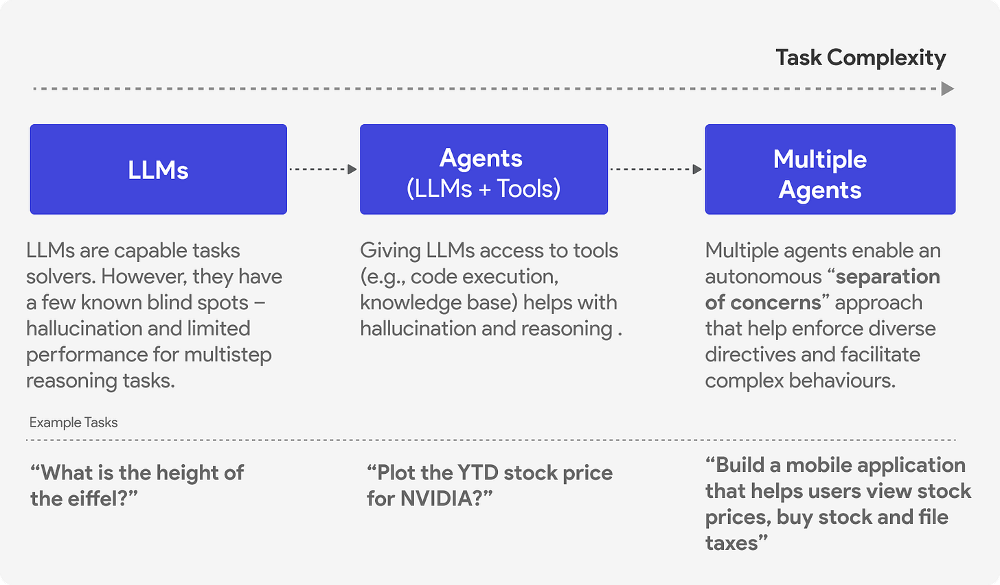
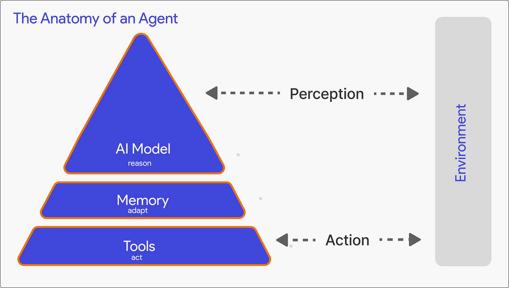

# Agent 执行循环：如何从头构建 AI Agent

> **原文**：https://newsletter.victordibia.com/p/the-agent-execution-loop-how-to-build  
> **作者**：Victor Dibia, PhD  
> **翻译**：由 OpenClaw 翻译

**Issue #52 | AI Agent 底层如何工作——支持推理、工具调用和迭代问题解决的执行循环。**

---

2025 年被称为 Agentic AI 元年。Google Gemini CLI、Claude Code、GitHub Copilot agent 模式、Cursor 等工具都是 Agent 的例子——能够执行开放性任务、规划、采取行动、反思结果、循环直到任务完成的自主实体。它们正在创造真正的价值。

但 Agent 实际上是如何工作的？你如何构建一个？

在本文中，我将带你了解 Agent 功能的核心：驱动这些复杂行为的 Agent 执行循环。

> **注**：本文改编自我的书《Designing Multi-Agent Systems》，第二部分（第 4-6 章）将带你从头构建一个完整的 Agent 框架。

---

## 什么是 Agent？

Agent 是一个能够推理、行动、沟通和适应以解决问题的实体。

考虑你可能向 GPT5 或 Claude 这样的生成式 AI 模型提出的两个问题：

- "法国的首都是什么？"
- "NVIDIA 今天的股价是多少？"

第一个问题模型可以直接回答（它很可能见过这个具体事实/知识的实例，现在已编码在其模型权重中）。第二个不能——模型会幻觉一个听起来合理但错误的答案，因为它无法访问实时数据。

Agent 设置通过识别需要当前数据、调用金融 API 并返回实际价格来解决这个问题。这需要行动，而不仅仅是文本生成。



---

## Agent 组件

简单来说，Agent 有三个核心组件：

- **Model**：推理引擎（通常是 GPT-5 这样的 LLM），处理上下文并决定做什么
- **Tools**：Agent 可以调用的函数以采取行动——API、数据库、代码执行、网络搜索
- **Memory**：短期（对话历史）和长期（跨会话持久化存储）



---

## 调用 LLM

在构建 Agent 之前，你需要了解如何调用生成式 AI 语言模型。以下是使用 OpenAI API 的基本模式：

```javascript
import { AsyncOpenAI } from "openai";

const client = new AsyncOpenAI({ apiKey: "your-api-key" });

const response = await client.chat.completions.create({
  model: "gpt-5",
  messages: [
    { role: "system", content: "You are a helpful assistant." },
    { role: "user", content: "What is 2 + 2?" }
  ]
});

console.log(response.choices[0].message.content);
// Output: "4"
```

API 接收消息列表（系统指令、用户输入、之前的助手响应）并返回补全。这是单个请求-响应周期。

为了启用工具的使用（tool calling），你还需要传递工具定义：

```javascript
const response = await client.chat.completions.create({
  model: "gpt-5",
  messages: messages,
  tools: [{
    type: "function",
    function: {
      name: "get_stock_price",
      description: "Get current stock price for a symbol",
      parameters: {
        type: "object",
        properties: {
          symbol: { type: "string", description: "Stock symbol like NVDA" }
        },
        required: ["symbol"]
      }
    }
  }]
});
```

当模型决定需要使用工具时，它返回的不是文本内容，而是一个包含函数名和参数的 `tool_calls` 数组。

---

## Agent 执行循环

这是每个 Agent 都遵循的核心模式：

```
1. 准备上下文  →  组合任务 + 指令 + 记忆 + 历史
2. 调用模型   →  发送上下文到 LLM，获取响应
3. 处理响应   →  如果是文本，完成。如果是工具调用，执行它们。
4. 迭代       →  将工具结果添加到上下文，返回步骤 2
5. 返回       →  最终响应准备就绪
```

代码实现：

```javascript
async function run(task) {
  // 1. 准备上下文
  const messages = [
    { role: "system", content: this.instructions },
    { role: "user", content: task }
  ];

  while (true) {
    // 2. 调用模型
    const response = await this.client.chat.completions.create({
      model: "gpt-5",
      messages: messages,
      tools: this.toolSchemas
    });

    const assistantMessage = response.choices[0].message;
    messages.push(assistantMessage);

    // 3. 处理响应
    if (!assistantMessage.tool_calls) {
      // 没有工具调用 - 完成
      return assistantMessage.content;
    }

    // 4. 执行工具并迭代
    for (const toolCall of assistantMessage.tool_calls) {
      const result = await this.executeTool(
        toolCall.function.name,
        JSON.parse(toolCall.function.arguments)
      );
      messages.push({
        role: "tool",
        tool_call_id: toolCall.id,
        content: result
      });
    }
    // 循环继续 - 模型将处理工具结果
  }
}
```

关键洞察：Agent 在单次运行中采取多个步骤（模型调用 → 工具执行 → 模型调用）。循环持续直到模型返回文本响应而不是工具调用。在某些情况下，我们可能需要额外的逻辑来指导程序控制流（例如终止条件，如最大轮次数）以避免无限循环等边缘情况及其成本影响。


---

## 工具执行

当模型返回工具调用时，你需要实际执行它：

```javascript
async executeTool(name, arguments) {
  const tool = this.tools[name];
  try {
    const result = await tool(...arguments);
    return String(result);
  } catch (e) {
    return `Error: ${e}`;
  }
}
```

结果作为工具消息添加回消息历史，循环继续。模型看到工具返回的内容，可以继续调用更多工具或生成最终响应。

---

## 完整示例

整合起来：

```javascript
class Agent {
  constructor(instructions, tools) {
    this.client = new AsyncOpenAI();
    this.instructions = instructions;
    this.tools = { [tools[0].name]: tools[0] };
    this.toolSchemas = tools.map(t => t.schema);
  }

  async run(task) {
    const messages = [
      { role: "system", content: this.instructions },
      { role: "user", content: task }
    ];

    while (true) {
      const response = await this.client.chat.completions.create({
        model: "gpt-5",
        messages: messages,
        tools: this.toolSchemas
      });

      const msg = response.choices[0].message;
      messages.push(msg);

      if (!msg.tool_calls) {
        return msg.content;
      }

      for (const tc of msg.tool_calls) {
        const result = await this.executeTool(
          tc.function.name,
          JSON.parse(tc.function.arguments)
        );
        messages.push({
          role: "tool",
          tool_call_id: tc.id,
          content: result
        });
      }
    }
  }
}

// 使用示例
async function getStockPrice(symbol) {
  // 实际中调用 API
  return `${symbol}: $142.50`;
}

const agent = new Agent(
  "You help users get stock information.",
  [{ name: "get_stock_price", fn: getStockPrice, schema: { ... } }]
);

const result = await agent.run("What's NVIDIA trading at?");
console.log(result);
// "NVIDIA (NVDA) is currently trading at $142.50."
```

执行流程：
1. Agent 收到 "What's NVIDIA trading at?"
2. 调用模型，模型决定使用 `get_stock_price`
3. 执行 `get_stock_price("NVDA")` → 返回 "$142.50"
4. 将结果添加到消息，再次调用模型
5. 模型生成整合了数据的自然语言响应

---

## 同一模式，不同框架

我们构建的执行循环与生产级 Agent 框架使用的模式相同。语法不同，但核心架构一致：定义工具、用指令创建 Agent、在任务上运行它。以下代码片段展示了这些想法在 Microsoft Agent Framework、Google ADK 和 LangGraph 等框架中的实现。

**Microsoft Agent Framework:**

```javascript
import { ai_function } from "@microsoft/agent-framework";

@ai_function
function getWeather(location) {
  return `The weather in ${location} is sunny, 75°F`;
}

const client = new AzureOpenAIChatClient({ deploymentName: "gpt-4.1-mini" });
const agent = client.createAgent({
  name: "assistant",
  instructions: "You are a helpful assistant.",
  tools: [getWeather]
});

const result = await agent.run("What's the weather in Paris?");
```

**Google ADK:**

```javascript
import { Agent } from "@google/adk";

function getWeather(location) {
  return `The weather in ${location} is sunny, 75°F`;
}

const agent = new Agent({
  name: "assistant",
  model: "gemini-flash-latest",
  instruction: "You are a helpful assistant.",
  tools: [getWeather]
});

// 通过 InMemoryRunner 运行
```

**LangGraph:**

```javascript
import { tool } from "@langchain/core/tools";
import { createReactAgent } from "@langgraph/prebuilt";

@tool
function getWeather(location) {
  return `The weather in ${location} is sunny, 75°F`;
}

const agent = createReactAgent({
  model: llm,
  tools: [getWeather]
});

const result = agent.invoke({
  messages: [("user", "What's the weather in Paris?")]
});
```

三个框架都是：定义函数 → 包装为工具 → 传递给 Agent → 调用 run。底层执行循环处理模型调用、工具执行和迭代。

---

## 还缺什么

这个基本循环有效，但生产级 Agent 还需要更多：

- **流式输出**：长任务需要进度更新，而不是仅仅返回最终响应
- **记忆**：跨会话持久化上下文
- **中间件**：日志、限流、安全检查
- **错误处理**：重试、优雅降级
- **上下文管理**：随上下文增长的摘要/压缩
- **编排多个 Agent**：确定性工作流和自主编排模式（handoff、magentic one 等）
- **最终用户界面**：将 Agent 集成到 Web 应用
- **完整用例**：构建具有文件系统访问、代码执行和迭代调试的完整编码 Agent

这些在《Designing Multi-Agent Systems》一书中都有深入涵盖，该书从头构建了一个具有所有这些功能的完整 Agent 框架（picoagents）并包含两个完整用例。
